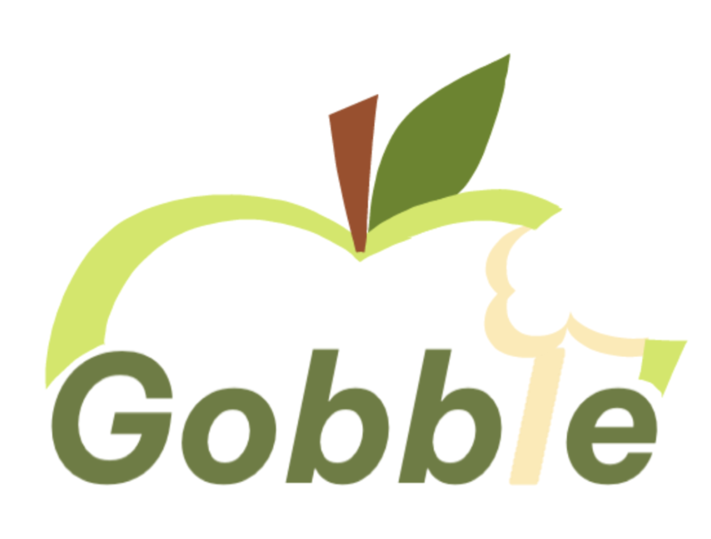

<a name="readme-top"></a>


[![Contributors][contributors-shield]][contributors-url]
[![Forks][forks-shield]][forks-url]
[![Stargazers][stars-shield]][stars-url]
[![Issues][issues-shield]][issues-url]


<!-- PROJECT LOGO -->
<br />
<div align="center">
 <a href="https://github.com/Kathy331/hophack2025-health">
   
 </a>

 <h3 align="center">Gobble - Intelligent Food Management</h3>


 <p align="center">
   Johns Hopkins University Hackathon 2025 Submission
   <br />
   <a href="https://github.com/Kathy331/hophack2025-health"><strong>Explore the docs »</strong></a>
   <br />
   <br />
   <a href="https://devpost.com/software/gobble-ru6bdy?ref_content=user-portfolio&ref_feature=in_progress">View DevPost</a>
   ·
   <a href="test">View Demo</a>
   ·
   <a href="https://github.com/Kathy331/hophack2025-health/issues/new?labels=bug&template=bug-report---.md">Report Bugs</a>
   ·
   <a href="https://github.com/Kathy331/hophack2025-health/issues/new?labels=enhancement&template=feature-request---.md">Request Features</a>
   <br />
   Contributions, issues, and feature requests are welcome!
   <br />
   Maintained by:<a href="https://github.com/Kathy331"> @Kathy331</a>


 </p>
</div>


<!-- TABLE OF CONTENTS -->
<details>
 <summary>Table of Contents</summary>
 <ol>
   <li>
     <a href="#about-the-project">About The Project</a>
     <ul>
       <li><a href="#built-with">Built With</a></li>
     </ul>
   </li>
   <li>
     <a href="#getting-started">Getting Started</a>
     <ul>
       <li><a href="#prerequisites">Prerequisites</a></li>
       <li><a href="#setup">Setup</a></li>
     </ul>
   </li>
   <li><a href="#usage">Usage</a></li>
   <li><a href="#system-architecture-diagram">System Architecture Diagram</a></li>
   <li><a href="#contact-and-developers">Contact and Developers</a></li>
   <li><a href="#acknowledgments">Acknowledgments</a></li>
 </ol>
</details>


<!-- ABOUT THE PROJECT -->
## About The Project
Our app (Gobble) is your one-stop shop for food management. It has a dashboard for you to track how much money and food you have saved through the app, reminders to remind you to eat food that is going to expire, an AI image and receipt analyzer to easily upload and keep track of the freshness of your food, and an AI recipe maker that will give you recipe recommendations based on what you currently have. Other features include a YouTube-to-recipe generator and an AI-powered shelf life calculator that accounts for putting food on the shelf, fridge, or freezer.


<!-- Built With -->
### Built With


#### Frontend
*  - Cross-platform mobile app development
*  - Type-safe JavaScript development


#### Backend
*  - Core backend language
*  - Modern, fast web framework for building APIs
*  - Open source Firebase alternative


#### AI & APIs
*  - AI-powered text and image analysis
*  - Video content extraction and analysis


<p align="right">(<a href="#readme-top">back to top</a>)</p>


<!-- GETTING STARTED -->
## Getting Started


**Warning!** This Project is done in university wifi, because of firewall issues, you might need to use your phone's hotspot to run ngrok Follow these steps to get a local copy up and running:


### Setup


1. Clone the repo:
  ```bash
  git clone https://github.com/Kathy331/hophack2025-health.git
  cd hophack2025-health
  ```
2. Install dependencies
  ```bash
  cd frontend
  npm install
  ```
3. Setting up Python environment in VS Code:
   ```bash
   cd backend
   # Create and activate virtual environment
   python3 -m venv venv
   source venv/bin/activate  # On Windows use `venv\Scripts\activate`
   pip install -r requirements.txt
   ```


 ### Select the Virtual Environment in VS Code:
 1. Open Command Palette (Cmd/Ctrl + Shift + P)
 2. Type "Python: Select Interpreter"
 3. Choose the interpreter from ./venv/bin/python (python 1.10+)
  ### To verify the interpreter:
 - Look at the bottom-left corner of VS Code
 - Should show "Python ('venv': venv)"
 - Or run this in terminal: `which python`
 - use `deactivate` command to exit the virtual environment


4. ngrok is used to expose the backend server to the internet so that the expo app can access it. set up ngrok account from https://dashboard.ngrok.com/signup and after logging in, go to https://dashboard.ngrok.com/get-started/your-authtoken and copy your authtoken.
   ```bash
   npm install -g ngrok
   ```
   ```bash
   ngrok config add-authtoken <your-authtoken>
   ```
5. Copy .env.example to .env and fill in your:
   - GEMINI_API_KEY from https://aistudio.google.com/app/apikey
   ```bash
   cd backend
   cp .env.example .env
   ```
   ```bash
   GEMINI_API_KEY=your_gemini_api_key
   ```
6. find config.ts and Set the
   - backendUrl (the https forwarding url you get from ngrok)
   ```bash
   export const backendUrl = "your_ngrok_url"
   ```


7. Development set up (Terminal A): start ngrok in a new terminal window
   ```bash
   cd backend
   ngrok http 3000
   ```
8. Development set up (Terminal B): start the backend server
   ```bash
   cd backend
   uvicorn app.main:app --host 0.0.0.0 --port 3000 --reload
   ```
9. Development set up (Terminal C): start the frontend server
   ```bash
   cd frontend
   npx expo start --tunnel
   ```


<p align="right">(<a href="#readme-top">back to top</a>)</p>


<!-- USAGE -->
## Usage
<!-- [demo]() -->
Once the app is running, you can:
<!-- Home Page-->
- **Sign up / Log in**: Create a new account or log in with your existing credentials
- **View your dashboard**: See an overview of your food inventory, savings, and recent activity
- **Smart recipe suggestions**: Get personalized recipe ideas based on your available ingredients, and soon to be expired food items


<!-- Inventory -->
- **View your inventory**: See a list of all food items you have added in shelf, refrigerator, and freezer
- **Track expiration dates**: Monitor the freshness of your food with automatic expiration date tracking and notifications
<!-- - **Update quantities**: Easily adjust the quantity of each food item as you use or add
- **Search and filter**: Quickly find specific food items by name, category, or expiration status -->


<!-- Add -->
- **Add food items**: Scan receipts or upload images to automatically add food items to your inventory with AI-powered analysis
- **Select storage location**: Specify if the food is stored in the refrigerator, freezer, or shelf for accurate shelf life calculations
- **smart storage location suggestions**: Based on the food item, the app autofill the best storage location for you


<!-- Recipes -->
- **paste in a YouTube link**: Get a full recipe generated, ingredient list, from any YouTube cooking video
<!-- Profile -->
- **View and edit your profile**: Manage your account settings, preferences, and personal information
<!-- - **Track your savings**: See how much money and food you have saved by using the app over time
- **Settings**: Customize your notification preferences, theme, and other app settings -->


<p align="right">(<a href="#readme-top">back to top</a>)</p>


<!-- CONTACT -->
## Contact and Developers


Kathy Chen - [@Linkedin](https://www.linkedin.com/in/kathy-chen-b35b532a6/) - email: kathychen331@outlook.com


Isaac Roy - [@Linkedin](https://www.linkedin.com/in/isaac-roy-b21567290/) - email:


Curtis L- [@Linkedin](https://www.linkedin.com/in/curtis-l-92674a30b/) - email:


Trina Cheng - [@Linkedin](https://www.linkedin.com/in/trina-cheng-48697a329/) - email:


<p align="right">(<a href="#readme-top">back to top</a>)</p>


<!-- ACKNOWLEDGMENTS -->
## Acknowledgments
* [HopHack 2025](https://hophacks.com/#cover-section)
* [Google Gemini](https://aistudio.google.com/)
* [Supabase](https://supabase.com/)
* [FastAPI](https://fastapi.tiangolo.com/)


<p align="right">(<a href="#readme-top">back to top</a>)</p>


<!-- MARKDOWN LINK & IMAGE DEFINITIONS -->
[contributors-shield]: https://img.shields.io/github/contributors/Kathy331/hophack2025-health.svg?style=flat-square
[contributors-url]: https://github.com/Kathy331/hophack2025-health/graphs/contributors
[forks-shield]: https://img.shields.io/github/forks/Kathy331/hophack2025-health.svg?style=flat-square
[forks-url]: https://github.com/Kathy331/hophack2025-health/network/members
[stars-shield]: https://img.shields.io/github/stars/Kathy331/hophack2025-health.svg?style=flat-square
[stars-url]: https://github.com/Kathy331/hophack2025-health/stargazers
[issues-shield]: https://img.shields.io/github/issues/Kathy331/hophack2025-health.svg?style=flat-square
[issues-url]: https://github.com/Kathy331/hophack2025-health/issues


